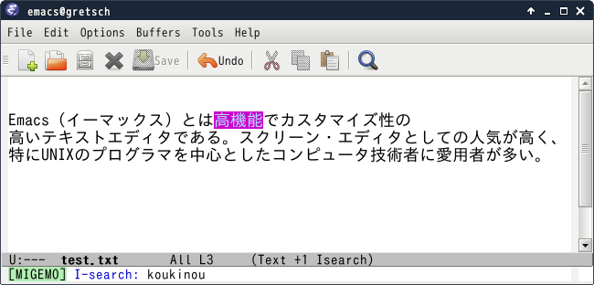

# migemo.el

migemo.el provides Japanese increment search with 'Romanization of Japanese'(ローマ字).


## screenshot




## Requirements

* Emacs 24 or higher.
* cl-lib.el
* [cmigemo](https://github.com/koron/cmigemo) or [CVS Head migemo](http://0xcc.net/migemo/)


## Sample Configuration

### cmigemo

```lisp
(require 'migemo)
(setq migemo-command "cmigemo")
(setq migemo-options '("-q" "--emacs"))

;; Set your installed path
(setq migemo-dictionary "/usr/local/share/migemo/utf-8/migemo-dict")

(setq migemo-user-dictionary nil)
(setq migemo-regex-dictionary nil)
(setq migemo-coding-system 'utf-8-unix)
(migemo-init)
```
